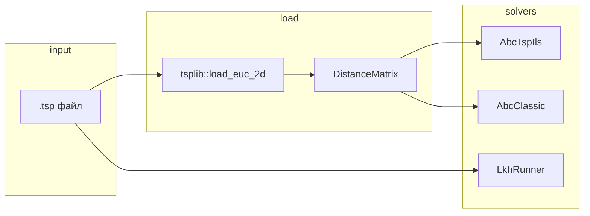

# Справочник по исходному коду `abc_rust/src`

Документ описывает **все файлы** под `abc_rust/src` (включая `src/bin/`): назначение, публичный API, ключевую логику и связи между модулями. Версия по состоянию репозитория; при изменении кода обновляйте этот файл.

---

## Содержание

1. [Назначение крейта](#1-назначение-крейта)
2. [Дерево файлов](#2-дерево-файлов)
3. [Точка входа библиотеки: `lib.rs`](#3-точка-входа-библиотеки-librs)
4. [Модули ядра](#4-модули-ядра)
5. [Гибрид ABC + ILS: `abc.rs`](#5-гибрид-abc--ils-abcrs)
6. [Классический ABC: `abc_classic.rs`](#6-классический-abc-abc_classicrs)
7. [Исполняемые файлы](#7-исполняемые-файлы)
8. [Зависимости (`Cargo.toml`)](#8-зависимости-cargotoml)
9. [Поток данных (схема)](#9-поток-данных-схема)

---

## 1. Назначение крейта

Крейт `abc_rust` — **CPU-only** порт Python-реализаций:

- **`ABCTSPILS`** (гибрид искусственной пчелиной колонии и ILS для симметричной TSP) → тип [`AbcTspIls`](#5-гибрид-abc--ils-abcrs).
- **`ABC_Classic`** (классический ABC для TSP) → тип [`AbcClassic`](#6-классический-abc-abc_classicrs).

Входные данные — экземпляры TSPLIB в формате **`EUC_2D`** с секцией **`NODE_COORD_SECTION`**. Расстояния сводятся к [`DistanceMatrix`](#41-tsprs); качество тура оценивается через **длину тура** и (в фазах отбора) **фитнес** `1 / (distance + ε)`.

---

## 2. Дерево файлов

```
abc_rust/src/
├── lib.rs              # объявление модулей и re-exports
├── main.rs             # бинарник abc-tsp
├── abc.rs              # AbcTspIls + AbcConfig
├── abc_classic.rs      # AbcClassic
├── adaptive.rs         # adaptive_parameters / AdaptiveParams
├── init.rs             # nearest_neighbor, greedy_init
├── perturb.rs          # возмущения тура (double-bridge, …)
├── local_search.rs     # 2-opt, 3-opt, списки соседей
├── tsp.rs              # DistanceMatrix, fitness_from_distance
├── tsplib.rs           # load_euc_2d, TsplibError
├── lkh.rs              # LkhRunner, LkhResult, LkhError
├── task_sets.rs        # MENU_TASKS, BENCHMARK_TASKS
└── bin/
    ├── benchmark.rs       # abc-benchmark
    ├── compare_benchmark.rs  # abc-compare
    ├── interactive.rs     # abc-main
    └── lkh_run.rs         # lkh-run
```

---

## 3. Точка входа библиотеки: `lib.rs`

Объявляет модули и **реэкспортирует** основные типы для удобного `use abc_rust::…`:

| Re-export | Источник |
|-----------|----------|
| `AbcConfig`, `AbcTspIls` | `abc` |
| `AbcClassic` | `abc_classic` |
| `adaptive_parameters`, `AdaptiveParams` | `adaptive` |
| `DistanceMatrix` | `tsp` |
| `LkhError`, `LkhResult`, `LkhRunner` | `lkh` |
| `BENCHMARK_TASKS`, `MENU_TASKS` | `task_sets` |
| `load_euc_2d`, `TsplibError` | `tsplib` |

Остальные модули (`init`, `local_search`, `perturb`) доступны как `abc_rust::init::…` и т.д., если нужны извне.

---

## 4. Модули ядра

### 4.1. `tsp.rs`

**Роль:** хранение полной матрицы расстояний и вычисление длины тура.

**Типы и функции:**

| Элемент | Описание |
|---------|----------|
| `DistanceMatrix` | Квадратная матрица `n×n` в виде одномерного `Vec<f64>` (строка `i`: смещение `i * n`). Поля `n`, `data` не публичны; доступ через методы. |
| `from_square(data, n)` | Создание; `assert_eq!(data.len(), n*n)`. |
| `n()` | Число городов. |
| `get(i, j)` | Элемент матрицы. |
| `data()` | Срез всей матрицы (подряд). |
| `tour_length(tour)` | Сумма рёбер `(t[0],t[1])…(t[n-2],t[n-1])` плюс замыкающее ребро `(t[n-1], t[0])`. Пустой тур → `0.0`. |
| `fitness_from_distance(distance)` | `1.0 / (1e-9 + distance)` — чем короче тур, тем выше фитнес. |

**Инвариант:** тур — перестановка индексов `0..n-1` (как в остальном коде).

---

### 4.2. `tsplib.rs`

**Роль:** минимальный разбор TSPLIB для **симметричной** евклидовой задачи.

**Ошибки:** `TsplibError::Io` | `TsplibError::Parse(&'static str)`.

**Функции:**

| Функция | Поведение |
|---------|-----------|
| `load_euc_2d(path)` | Читает файл построчно: ищет `DIMENSION` (цифры после `:`), затем секцию `NODE_COORD_SECTION`, парсит строки `id x y` до `EOF` / `DISPLAY_DATA_SECTION`. Строит полную матрицу попарных расстояний. |

**Расстояние `EUC_2D`:** как в TSPLIB — евклидова норма, затем **`nint` (округление к ближайшему целому)**.

**Ограничения:** не читает `EDGE_WEIGHT_SECTION`; ожидается, что координат ровно `DIMENSION`.

---

### 4.3. `adaptive.rs`

**Роль:** те же **ступени по числу городов**, что `get_adaptive_parameters` в корневом `main.py`.

**Структура `AdaptiveParams`:**

| Поле | Смысл |
|------|--------|
| `num_employed_bees` | Число рабочих пчёл |
| `num_onlooker_bees` | Число наблюдателей |
| `limit` | Порог «trial» для скаутов (в гибриде динамически подстраивается) |
| `patience` | Итерации без улучшения лучшего → ранний выход |
| `local_search_interval` | База для периода глобального LS в `AbcTspIls` |
| `heuristic_init_ratio` | Доля эвристически инициализированных особей при старте |
| `max_iterations` | Верхняя граница итераций главного цикла |

**Ветвление `adaptive_parameters(num_cities)`:**

| Условие | Пример настроек |
|---------|-----------------|
| `< 100` | 15/20 пчёл, patience 150, max_iter 1000 |
| `< 200` | 20/25, patience 200, max_iter 2000 |
| `< 300` | 15/30, patience 500, max_iter 3000 |
| `< 500` | 40/50, patience 350, max_iter 4000 |
| `≥ 500` | пчёлы масштабируются от `n` (`n/10`, `n/8`, минимумы 50/60), patience 400, max_iter 5000 |

Точные числа — в исходнике; их используют `abc-main`, `abc-benchmark`, `abc-compare`.

---

### 4.4. `task_sets.rs`

**Роль:** константные списки имён файлов `.tsp` и **эталонных** длин тура (как в Python).

| Константа | Соответствие в репозитории |
|-----------|----------------------------|
| `MENU_TASKS` | `main.py` (интерактивное меню) |
| `BENCHMARK_TASKS` | `benchmark.py` |

**Важно:** для одних и тех же имён (например `rd100.tsp`, `rd400.tsp`) в двух списках могут отличаться **оптимумы** — при объединении в бенчмарках обычно задаётся правило «первое вставленное в `HashMap` значение» (см. `abc-compare`).

---

### 4.5. `init.rs`

**Роль:** конструктивные эвристики старта тура.

| Функция | Описание |
|---------|----------|
| `nearest_neighbor(rng, dm, start)` | NN: от `start` или случайного города — на каждом шаге ближайший непосещённый. |
| `greedy_init(dm)` | Жадная вставка рёбер: сортировка всех рёбер по длине, Union-Find, степень узла ≤ 2, избегание преждевременного цикла до `n-1` рёбер; обход полученного 2-регулярного графа в тур. |

Внутренний тип `UnionFind` — только для `greedy_init`.

---

### 4.6. `perturb.rs`

**Роль:** нарушение тура для разнообразия / выхода из локальных минимумов.

| Функция | Описание |
|---------|----------|
| `two_opt_swap(tour, i, k)` | Разворот сегмента `[min(i,k)..=max(i,k)]`. |
| `double_bridge(rng, tour)` | Классический double-bridge: 4 случайных разреза, пересборка сегментов. При `n < 8` — один случайный 2-opt. |
| `multi_insert(rng, tour, num_cities_to_move)` | Случайно выбранные позиции удаляются и вставляются блоком в случайное место (как в Python). |
| `perturbation_random_2opt(rng, tour, strength)` | Несколько случайных 2-opt подряд (`strength ≥ 1`). |

---

### 4.7. `local_search.rs`

**Роль:** локальный поиск и вспомогательные структуры.

| Функция | Описание |
|---------|----------|
| `build_nearest_neighbors(dm, n_neighbors)` | Для каждого города — `n_neighbors` ближайших других (при равенстве расстояния — по индексу). |
| `fast_2opt(dm, tour)` | Полный first-improvement 2-opt по классическим индексам `(i,j)` с запретом деградации замыкающего ребра в тривиальном случае. |
| `fast_2opt_neighbors(dm, tour, neighbors)` | Ограниченный 2-opt: для ребра `(u,u_next)` перебираются соседи `u` из списка; при улучшении — сегмент реверсируется через `pos[]`. |
| `local_search_2opt(dm, initial)` | Обёртка: `fast_2opt` + длина. |
| `local_search_3opt(dm, initial)` | Упрощённый 3-opt-стиль: перебор троек индексов, оценка одного шаблона переподключения, при улучшении — `two_opt_swap` по паре `(i,j)`; цикл до стабилизации. |

Использование в `AbcTspIls`: соседние списки при `n > 50`; глобальный LS вызывает либо ограниченный 2-opt, либо полный через обёртку, либо `local_search_3opt` при узкой задаче и «застое» улучшений LS.

---

### 4.8. `lkh.rs`

**Роль:** запуск **внешнего бинарника** LKH (аналог `LKH/run_lkh.py`).

**`LkhRunner`:**

| Метод | Описание |
|-------|----------|
| `new(path)` | Путь к исполняемому файлу `LKH`. |
| `from_repo_root(repo_root)` | `repo_root/LKH/LKH-2.0.7/LKH`. |
| `binary_exists()` | `Path::exists`. |
| `run(tsp_file, work_dir, max_trials, time_limit_sec, seed)` | Создаёт `work_dir`, пишет `.par` с `PROBLEM_FILE`, `SEED`, `MAX_TRIALS`, `TIME_LIMIT`, `OUTPUT_TOUR_FILE`; запускает `LKH problem.par`; парсит **стоимость** из строки с `COST` и `=`. |

**`LkhResult`:** `cost`, `time_sec` (wall по `Instant`), `stdout_stderr`.

**`LkhError`:** `BinaryNotFound`, `Io`, `Timeout` (зарезервировано; текущая реализация `run` использует `Command::output` без таймера ОС), `Parse`, `NonZeroExit`.

---

## 5. Гибрид ABC + ILS: `abc.rs`

### 5.1. Тип `Tour`

Псевдоним `Vec<usize>` — перестановка городов `0..n-1`.

### 5.2. `AbcConfig`

Поля задают размер колонии, пороги, долю эвристик при инициализации, известный оптимум (для отчётов/логики в Python; в Rust-полях может не использоваться напрямую в каждом шаге), **параллельный** employed-проход и число потоков.

**`Default`:** 50/50 пчёл, `limit` 100, `patience` 200, `local_search_interval` 50, `heuristic_init_ratio` 0.7, `optimal_known: None`, `use_parallel: true`, `num_workers: None`.

### 5.3. Внутреннее состояние `AbcTspIls`

Ключевые поля:

- `dm`, `config`, опционально **`neighbors`** (для `n > 50` строится `build_nearest_neighbors` с числом соседей 20/30/40/50 в зависимости от `n`).
- `employed: Vec<EmployedBee>` — решение, фитнес, счётчик `trial`.
- `best_tour`, `best_distance` — **минимальная** длина (в отличие от фитнеса, где больше = лучше).
- `history` — история `best_distance` по итерациям.
- `wait`, `best_iteration` — для ранней остановки по «нет улучшения лучшего».
- `historical_best` — очередь лучших туров для подмешивания в инициализацию (до `max_historical` записей).
- `ls_improvement_history` — последние улучшения глобального LS (для решения 2-opt vs 3-opt).
- `edge_memory` — матрица `n×n` «памяти рёбер» с затуханием `memory_decay` (0.95), обновляется от лучшего тура.
- `run_started_at`, `last_run_elapsed`, `last_run_iterations` — метрики последнего `run()`.

### 5.4. Фазы одной итерации (упрощённо)

1. **`employed_phase`:**  
   - При `use_parallel && n_bees > 10`: снимок всех пчёл, параллельно для каждого индекса `employed_step_snapshot` (отдельный `thread_rng` на задачу — **не** детерминировано от сида верхнего уровня).  
   - Иначе последовательный проход с обновлением «на лету».  
   **Шаг employed:** если `trial > limit/3` — double-bridge + случайные 2-opt; иначе OX с партнёром; при улучшении фитнеса — **обязательный** 2-opt (`fast_2opt` или `fast_2opt_neighbors`).

2. **`onlooker_phase`:** взвешенный softmax по фитнесам туров; три выборки индекса; базовый тур — с максимальным фитнесом среди трёх; мутация (инверсия сегмента / свап / сдвиг города); лучший онлайкер может **заменить** худшую employed-особь.

3. **`scout_phase`:** при `trial > limit` — новый кандидат из kick по лучшему туру (double-bridge ± multi-insert для больших `n`), затем 2-opt.

4. **Периодический глобальный LS** над лучшим туром (`local_2opt_search_global` → `adaptive_local_search`).

5. **Адаптация:** `adapt_parameters` (сжимается `local_search_interval`, динамика `patience` и `limit` по дисперсии фитнесов и прогрессу).

6. **Разнообразие:** `adaptive_diversity_control`, `inject_diversity`, при длительном стагнации — `force_light_perturbation`, `global_kick`.

7. **Ранняя остановка:** если `wait >= patience`.

### 5.5. Публичный API `AbcTspIls`

| Метод | Назначение |
|-------|------------|
| `new(dm, config)` | Конструктор; подготовка соседей и памяти. |
| `last_run_iterations()` | Число выполненных итераций главного цикла (последний `run`). |
| `last_run_elapsed()` / `last_run_elapsed_secs()` | Wall time последнего `run`. |
| `run_started_at()` | Момент старта отсчёта времени после инициализации популяции. |
| `run(rng, max_iterations)` | Возвращает `(best_tour, best_distance)`; печатает прогресс в stderr каждые 50 итераций и при early stop. |

### 5.6. Вспомогательные функции в файле

- `employed_step_snapshot` — один шаг employed для параллели.  
- `random_choice_index` — выбор индекса по вектору вероятностей.  
- `local_search_2opt_wrap` — обёртка над `fast_2opt` + длина.

---

## 6. Классический ABC: `abc_classic.rs`

**Роль:** порт логики из `ABC_Classic/ABC_classic.py` **без** ILS-слоя и без Rayon.

**Идея:** три роли пчёл — employed (OX с партнёром), onlooker (взвешенный отбор + мутация с принятием только если лучше случайного стартового тура итерации), scout (сброс при превышении `limit`).

**Публичный тип:** `AbcClassic`.

| Метод / поле | Описание |
|--------------|----------|
| `new(dm, num_employed_bees, num_onlooker_bees, limit, patience)` | Инициализация порогов. |
| `best_solution` | `pub` — лучший найденный тур. |
| `run(rng, max_iterations, verbose, log_interval)` | Главный цикл; возвращает `(tour, distance)`; пишет в stderr финишную строку с дистанцией, временем и числом итераций; при `verbose` — ранний стоп и периодический лог. |
| `last_run_iterations()` | Сколько итераций реально выполнено. |
| `last_run_elapsed()` / `last_run_elapsed_secs()` | Время последнего запуска. |

Внутренние функции: `ox_child` (как в `abc.rs`), `calc_selection_probs`, `pick_weighted`, `mutate_tour` (инверсия / свап / сдвиг), фазы `employed_phase`, `onlooker_phase`, `scout_phase`, `initialize_population` (случайные перестановки).

**Согласованность с CLI `abc-tsp --classic`:** в `main.rs` для классики задаются фиксированные `limit=20`, `patience=100`, независимо от `adaptive_parameters` — это **отличается** от бенчмарка `abc-compare`, где берутся `p.limit` и `p.patience` из адаптивных параметров.

---

## 7. Исполняемые файлы

Все задаются в `Cargo.toml` как `[[bin]]`.

### 7.1. `main.rs` → **`abc-tsp`**

| Аргумент | Назначение |
|----------|------------|
| `--tsp` | Путь к `.tsp` |
| `-i/--iterations` | Число итераций (по умолчанию 500) |
| `--seed` | Seed `ChaCha8Rng` |
| `--employed`, `--onlookers` | Размер колонии |
| `--optimal` | Опционально — вывод gap |
| `--classic` | `AbcClassic` вместо `AbcTspIls` |
| `--sequential` | `use_parallel = false` для гибрида |
| `--workers` | Число потоков Rayon |

Вывод в stdout: `best_distance`, `wall_time_sec`, опционально `optimal`/`gap_percent`, строка `tour` с индексами через пробел.

---

### 7.2. `bin/interactive.rs` → **`abc-main`**

Интерактивное меню по `MENU_TASKS`, загрузка `matrix_dir/task`, **`adaptive_parameters`**, конфиг `AbcTspIls` с **`use_parallel: false`**, `num_workers: Some(16)` (поле задано, но параллель отключён флагом), запуск на `max_iterations` из адаптива. Вывод финального тура, дистанции, времени, gap к оптимуму из меню.

---

### 7.3. `bin/benchmark.rs` → **`abc-benchmark`**

Аналог `benchmark.py`: задачи из **`BENCHMARK_TASKS`**, несколько прогонов (`--num-runs`, по умолчанию 10), сид `seed_base + run`, только **`AbcTspIls`** с адаптивными параметрами и параллелью. CSV: задача, номер прогона, время, дистанция, оптимум, gap, success (в пределах `SUCCESS_TOLERANCE_PCT`), столбец GPU = 0.

Флаги: `--matrix-dir`, `--output-csv`, `--only`, `--num-runs`, `--seed-base`.

---

### 7.4. `bin/compare_benchmark.rs` → **`abc-compare`**

Все файлы `*.tsp` в каталоге (или один `--only`), для каждой задачи подряд: **ABC_Classic**, **ABCTSPILS**, **LKH**. Оптимумы из объединения `MENU_TASKS` и `BENCHMARK_TASKS` (первая запись в `HashMap` выигрывает при дубликатах). CSV без столбцов «победитель»: сырые поля по строкам. Сиды: `seed_base + task_index * 10000` (classic), `+1` для ILS. LKH: `max_trials` 100000, `time_limit` 120 с, `seed` 42; при отсутствии бинарника — строка со статусом `SKIP`.

---

### 7.5. `bin/lkh_run.rs` → **`lkh-run`**

CLI вокруг `LkhRunner`: `--tsp`, `--example` (поиск репозитория и `matrix_task/eil51.tsp`), `--lkh-bin`, `--work-dir`, `--max-trials`, `--time-limit`, `--seed`, `--verbose`, `--print-paths`.

---

## 8. Зависимости (`Cargo.toml`)

| Крейт | Роль в проекте |
|-------|----------------|
| `rand`, `rand_chacha` | RNG (`ChaCha8Rng` в CLI/бенчмарках; `thread_rng` в параллельном employed) |
| `clap` | Парсинг аргументов у всех бинарников |
| `rayon` | Параллельный `employed_phase` в `AbcTspIls` |
| `csv` | Запись результатов бенчмарков |

Стандартная библиотека: процессы, I/O, время.

---

## 9. Поток данных (схема)



**Типичная цепочка для гибрида:** `load_euc_2d` → `adaptive_parameters(dm.n())` (в сценариях с меню/бенчмарком) → `AbcConfig { … }` → `AbcTspIls::new` → `run`.

---

## Связь с `ARCHITECTURE.md`

`ARCHITECTURE.md` даёт **краткий обзор** модулей и бинарников. Этот файл (`SRC_REFERENCE.md`) — **подробный справочник по API и поведению**; при расхождении приоритет у **фактического кода**, затем обновление документации.
